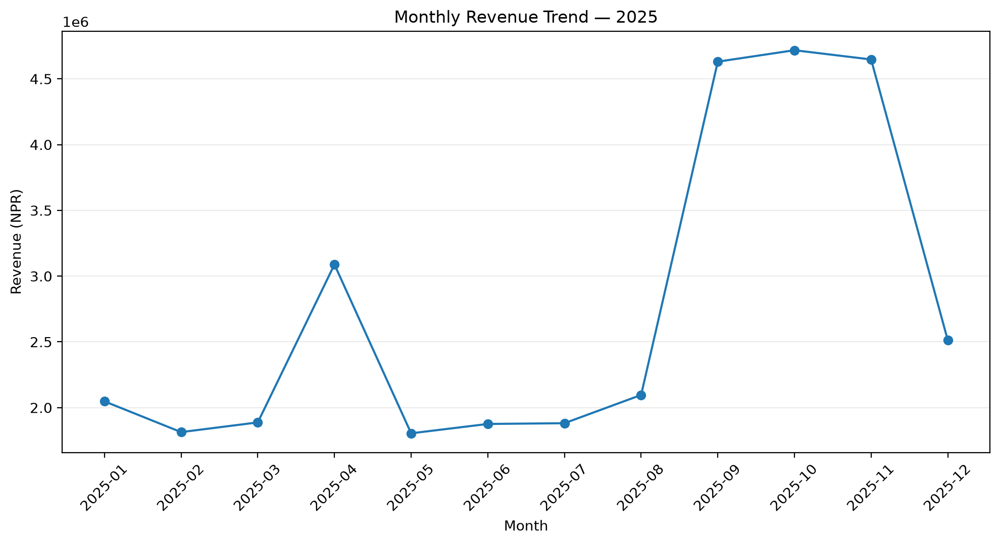
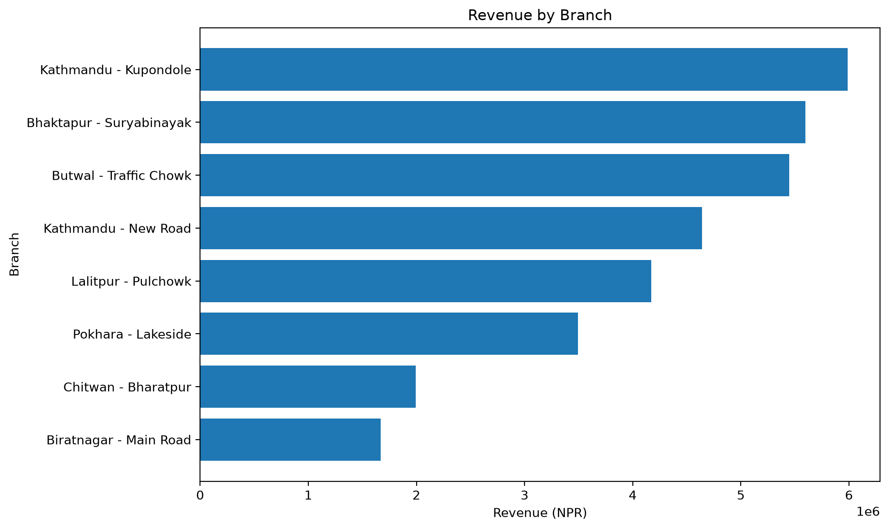
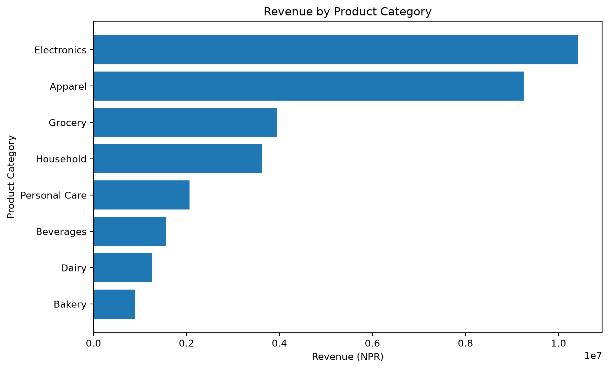
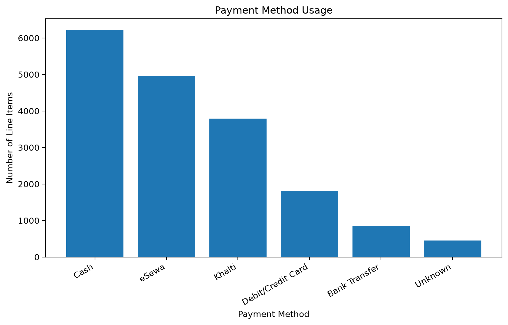
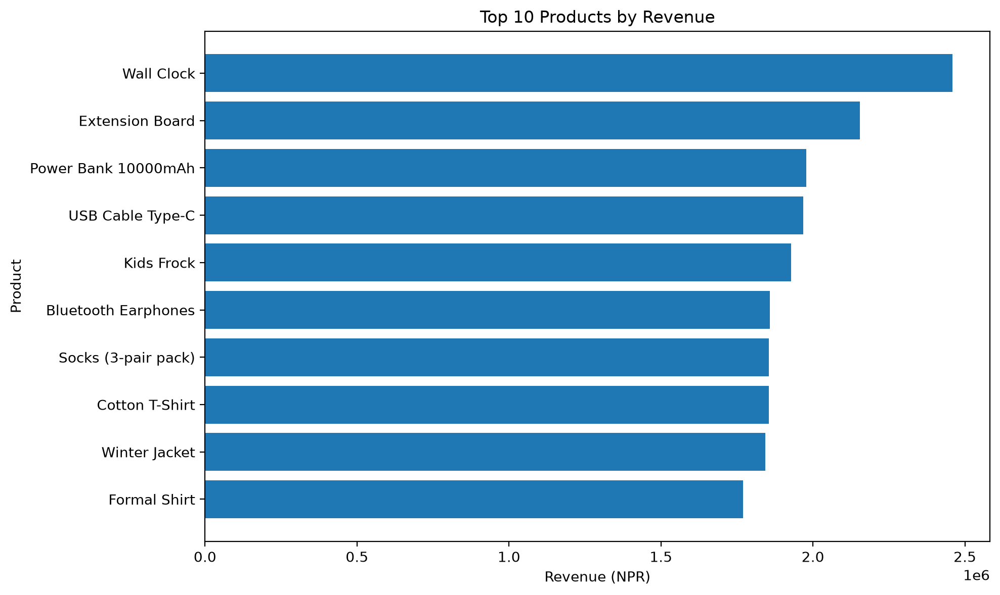

# BSCS — Bhatbhateni Sales Cleaning & Solutions

A complete Python portfolio project for cleaning, analysing, visualising, and modelling the Bhatbhateni 2025 sales dataset. The project answers Q1–Q17 from the supplied assignment and is ready to open in Visual Studio Code.

## Project structure

```text
BSCS_VSCode_Project/
├── data/
│   └── BSCS.csv
├── images/
│   ├── branch_revenue.png
│   ├── category_revenue.png
│   ├── monthly_revenue_trend.png
│   ├── payment_method_usage.png
│   ├── revenue_by_day.png
│   ├── top_products_revenue.png
│   └── total_amount_distribution.png
├── notebooks/
│   └── BSCS_Analysis.ipynb
├── outputs/
│   ├── BSCS_cleaned.csv
│   ├── analysis_report.md
│   ├── data_quality_summary.csv
│   └── supporting result tables
├── src/
│   └── bscs_analysis.py
├── .gitignore
├── README.md
└── requirements.txt
```

## Data-quality decisions

The raw dataset contains null values and exact duplicate rows. The cleaning process:

1. Removes only fully identical rows, not repeated `TransactionID` values, because one transaction can contain multiple products.
2. Fills missing customer names using the stable `CustomerID → CustomerName` mapping.
3. Fills missing categories using the stable `ProductName → ProductCategory` mapping.
4. Recovers missing unit prices from `TotalAmount / Quantity`, with median fallbacks.
5. Retains rows with missing payment methods and labels them `Unknown` rather than deleting valid revenue.
6. Converts dates and extracts year, month, day-of-week, weekend, and city features.
7. Validates `TotalAmount` against `Quantity × UnitPrice`.

## Run in VS Code

### 1. Open the project

In VS Code, choose **File → Open Folder** and select `BSCS_VSCode_Project`.

### 2. Install the Python and Jupyter extensions

Install the official **Python** and **Jupyter** extensions from Microsoft.

### 3. Create a virtual environment

Open the VS Code terminal and run:

```bash
python3 -m venv .venv
source .venv/bin/activate
```

On Windows PowerShell:

```powershell
python -m venv .venv
.venv\Scripts\Activate.ps1
```

### 4. Install packages

```bash
pip install -r requirements.txt
```

### 5. Run the complete script

```bash
python src/bscs_analysis.py
```

The script regenerates the cleaned dataset, report, result tables, charts, and model evaluation.

### 6. Run as a notebook

Open `notebooks/BSCS_Analysis.ipynb`, choose the `.venv` Python kernel, and select **Run All**.

## Main outputs

The completed written answers are in `outputs/analysis_report.md`. The cleaned dataset is `outputs/BSCS_cleaned.csv`. Key charts are stored in the `images` folder.

## Important modelling note

The predictive model is educational. Since `TotalAmount = Quantity × UnitPrice`, a model using quantity and price is learning a mathematical relationship rather than forecasting unknown future demand. A real forecasting model would instead predict future quantity, basket value, or branch revenue using lagged time-series and business features.

## Key findings from the supplied dataset

- Raw data: **18,812 rows and 11 columns**.
- Exact duplicate rows removed: **724**.
- Cleaned data: **18,088 line-items and 6,000 unique transactions**.
- Highest-revenue branch: **Kathmandu - Kupondole**.
- Highest-revenue city: **Kathmandu**.
- Highest-revenue category: **Electronics**.
- Peak revenue month: **October 2025**.
- Most common payment method: **Cash**.

## Portfolio visualisations

### Monthly revenue trend



### Branch revenue



### Category revenue



### Payment method usage



### Top products by revenue


